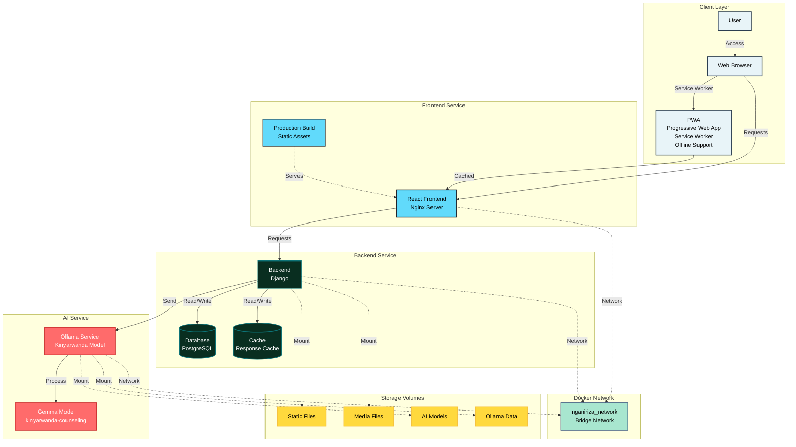
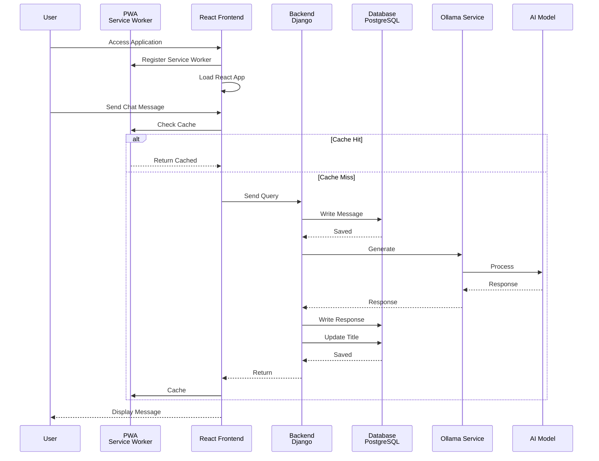

# Nganiriza System Architecture

## High-Level Architecture Diagram

## Service Communication Flow

## Component Details

### Client Layer
- **User**: End user accessing the application
- **Web Browser**: Browser rendering the application
- **PWA (Progressive Web App)**:
  - Service Worker for offline functionality
  - Caching strategies
  - Installable app experience
  - Background sync capabilities

### Frontend Service
- **Technology**: React with Vite
- **Server**: Nginx (Alpine)
- **Responsibilities**:
  - User interface rendering
  - Communication
  - State management
  - Routing
  - PWA support

### Backend Service
- **Technology**: Django
- **Database**: PostgreSQL
- **Server**: Gunicorn with 3 workers
- **Responsibilities**:
  - Endpoints
  - Authentication & authorization
  - Database operations
  - Business logic
  - AI service orchestration

### AI Service (Ollama)
- **Technology**: Ollama Runtime
- **Model**: Gemma Kinyarwanda Counseling Model
- **Responsibilities**:
  - Natural language processing
  - Kinyarwanda language support
  - Health counseling responses
  - Model inference

## Data Flow

1. **User Request**: User sends message via frontend
2. **PWA Check**: Service Worker checks cache for offline support
3. **Frontend Processing**: React app sends request to backend
4. **Backend Processing**: Backend receives request, saves to database
5. **AI Query**: Backend forwards query to Ollama service
6. **Model Inference**: Ollama processes query using Gemma model
7. **Response**: AI response flows back through backend to frontend
8. **Caching**: PWA caches response for offline access
9. **Display**: Frontend updates UI with AI response

## Network Architecture

- **Network Type**: Docker Bridge Network (`nganiriza_network`)
- **Service Discovery**: Container names (ollama1, backend, frontend)
- **Internal Communication**: Requests between services
- **External Access**: Client access via network

## Storage Architecture

- **Static Files**: Backend static assets (CSS, JS, images)
- **Media Files**: User-uploaded content
- **AI Models**: Gemma model files (.gguf)
- **Ollama Data**: Model cache and runtime data
- **PWA Cache**: Service Worker cache for offline functionality
